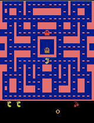
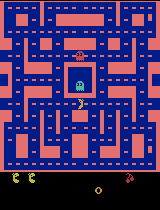
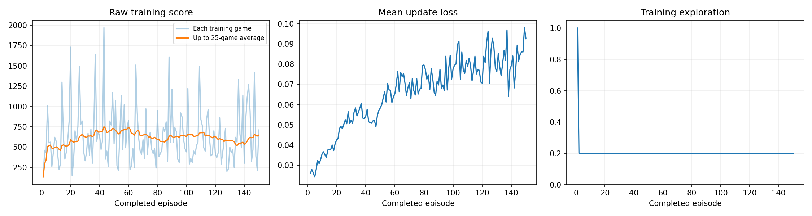

# Training a DQN Agent to Play Ms. Pac-Man

Class 3 assignment — a Deep Q-Network trained on `ALE/MsPacman-v5` with the ready-made
classroom notebook, run end to end on a Google Colab T4 GPU.

**My three hyperparameters: exploration `0.20`, episodes `150`, learning rate `0.0001`.**

**Result: mean score over the five evaluation games rose from 492.0 (untrained) to 754.0
(after 150 episodes), a change of +262.0.** The trained agent beat the untrained network
on three of the five matched games. The evaluation contains only five games, so this is a
small sample and should not be treated as strong evidence of a robust improvement — §5
gives all five scores so the comparison can be judged directly.

### Evidence — [`results/main_run_exp0.20_ep150_lr0.0001/`](results/main_run_exp0.20_ep150_lr0.0001/)

| | |
|---|---|
| **Executed notebook**, saved after the final run with all outputs | [`pacman_dqn.ipynb`](pacman_dqn.ipynb) |
| Settings, hardware, exact package versions | [`config.json`](results/main_run_exp0.20_ep150_lr0.0001/config.json) |
| All five before/after evaluation scores | [`comparison.json`](results/main_run_exp0.20_ep150_lr0.0001/comparison.json) |
| Untrained baseline scores | [`baseline.json`](results/main_run_exp0.20_ep150_lr0.0001/baseline.json) |
| Per-episode training log, 150 rows | [`training.csv`](results/main_run_exp0.20_ep150_lr0.0001/training.csv) |
| Episodes, decisions, learning updates, wall clock | [`training_summary.json`](results/main_run_exp0.20_ep150_lr0.0001/training_summary.json) |
| Checkpoint evaluations every 25 episodes | [`demo_scores.json`](results/main_run_exp0.20_ep150_lr0.0001/demo_scores.json) |
| Training plot | [`training_dashboard.png`](results/main_run_exp0.20_ep150_lr0.0001/training_dashboard.png) |
| Gameplay GIFs | [`gifs/`](results/main_run_exp0.20_ep150_lr0.0001/gifs/) |

---

## 1. Open and run the notebook

Open [`pacman_dqn.ipynb`](pacman_dqn.ipynb) in Google Colab
([the original starter notebook](https://colab.research.google.com/github/pepealonso95/pacman-dqn/blob/main/pacman_dqn.ipynb)),
select **Runtime → Change runtime type → T4 GPU**, confirm the three values in section 1,
and choose **Runtime → Run all**. The setup cell installs every package automatically.
To run it locally instead, open the notebook with a Python 3.11–3.13 kernel after
`pip install -r requirements.txt`.

This run took **328.9 seconds** of training plus evaluation time on a T4. Exact
environment, recorded in `config.json`: Python 3.13.15, torch 2.11.0+cu128,
gymnasium 1.3.0, ale-py 0.11.2, opencv-python-headless 4.14.0.94, numpy 2.1.3,
matplotlib 3.10.0, Pillow 11.3.0.

---

## 2. My three hyperparameters, and why

| Setting | Value | Why I chose it |
|---|---|---|
| **Exploration** (ε, held constant after the 1,000-decision warm-up) | **0.20** | The notebook default. 20% random / 80% greedy keeps fresh experience flowing into a replay buffer that only holds 5,000 transitions, while still letting the learned policy drive most decisions. Keeping the default also makes my run directly comparable to classmates' runs. |
| **Episodes** | **150** | 50% more games than the default 100, chosen to buy a meaningfully larger number of gradient updates (21,370) while keeping training inside a single short Colab session. |
| **Learning rate** | **0.0001** | The notebook default. With Adam and a Huber loss this is the stable choice; a larger step on a 5,000-transition buffer risks overfitting the most recent experience and letting the Q-values diverge. |

I edited **only** these three values in section 1. Every other setting is the notebook's
default, unmodified: replay capacity 5,000, batch size 32, 1,000 warm-up decisions, one
update every 4 decisions, target-network sync every 1,000 decisions, γ = 0.99, frame
skip 4, sticky-action probability 0.25, up to 30 no-ops on reset, no termination on life
loss, a 3,000-decision cap per game, seed 42.

**What I expected before training:** a small positive change, maybe 10–20%, on the
reasoning that 150 games is more than the default 100. I expected the training-score
curve to rise and the evaluation mean to follow it.

**What I observed:** the evaluation mean rose more than I expected (+53%), while the
training curve barely moved (+13% from the first 25 games to the last 25) — the opposite
relationship to the one I had assumed. Details in §5.

---

## 3. What the agent observes, does, and is rewarded for

**Observations — four game screens.** The agent never sees RAM or object coordinates.
Each raw 210×160 RGB Atari frame is converted to greyscale and resized to **84×84**, and
the **four most recent frames are stacked** into a `(4, 84, 84)` array. Four frames
rather than one is what makes the state usable: a single image shows where Pac-Man and
the ghosts *are*, but not which way they are *moving*. Pixels are rescaled to [0, 1]
inside the network. On reset the stack is filled with four copies of the opening frame.

One agent **decision** covers **4 emulator frames**, so the 3,000-decision cap is about
200 seconds of game time.

**Actions — joystick moves.** The nine discrete Ms. Pac-Man actions:
`NOOP, UP, RIGHT, LEFT, DOWN, UPRIGHT, UPLEFT, DOWNRIGHT, DOWNLEFT`. The network's final
layer emits one Q-value per action — an estimate of discounted future return, not a
probability. Selection is ε-greedy: with probability ε a uniformly random move, otherwise
`argmax_a Q(s, a)`.

**Reward — game points.** The game's own score increments: 10 per pellet, 50 per power
pellet, 200/400/800/1600 for successive ghosts eaten while powered, plus fruit bonuses.
Two things are worth keeping separate:

* **For learning**, rewards are **clipped to [−1, +1]**. This keeps gradients on a
  uniform scale across Atari games, but it also means the agent cannot tell a 10-point
  pellet from a 200-point ghost — every positive event looks identical to it.
* **For reporting**, every score in this README is the **raw, unclipped game score**.

The learning target is `r + γ · max_a′ Q_target(s′, a′)` with **γ = 0.99**, taken from a
slowly-updated target network synced every 1,000 decisions. The future-value term is
zeroed at true game over but **kept** when an episode ends by hitting the decision cap —
the game could have continued there, so bootstrapping is still correct.

---

## 4. How the before/after comparison was made

Before and after use **exactly the same evaluation settings**, unchanged from the
notebook: the same five seeds `[101, 202, 303, 404, 505]`, **ε = 0.05**, the same
3,000-decision cap, a separate environment, and no weight updates or replay writes.

The "before" baseline is the **untrained network** — randomly initialised weights played
at ε = 0.05 — **not** a random-action agent. That is why the baseline already scores ~492
rather than ~200.

---

## 5. What happened

Exploration 0.20 · 150 episodes · learning rate 0.0001 · seed 42

| Actual training budget | |
|---|---|
| Episodes completed | **150 / 150** — ran to completion, not interrupted |
| Agent decisions | **86,478** |
| Learning updates | **21,370** — non-zero; the warm-up was passed during episode 2 |
| Elapsed time, including periodic demos | **328.9 s** |
| Hardware | **CUDA — NVIDIA T4 GPU on Google Colab** |

### All five evaluation scores, both conditions

Raw data: [`comparison.json`](results/main_run_exp0.20_ep150_lr0.0001/comparison.json)

| Game (seed) | Before — untrained | After — 150 episodes | Change |
|---|---:|---:|---:|
| 1 (101) | 350 | 330 | −20 |
| 2 (202) | 500 | 770 | +270 |
| 3 (303) | 320 | 1000 | +680 |
| 4 (404) | 800 | 360 | **−440** |
| 5 (505) | 490 | 1310 | +820 |
| **Mean** | **492.0** | **754.0** | **+262.0** |
| Standard deviation (5 games) | 190.2 | 419.8 | |
| Mean decisions survived | 589.0 | 617.0 | +28 |
| Games stopped by the time limit | 0 / 5 | 0 / 5 | |

The mean rose 53% and the trained agent won three of the five matched games. The
evaluation contains only five games, so this is a small sample and should not be treated
as strong evidence of a robust improvement. Two of the five games moved the other way,
one of them by 440 points.

### Gameplay

GIFs play at 4× speed and show at most the first 20 seconds of game time; the scores
above cover each full game.

**Before training — untrained network** (evaluation seed 101)


**Best trained game** — highest-scoring of the five final evaluation games (game 5, seed
505, 1310 points)



In the recorded 20-second excerpts the trained and untrained agents look fairly similar:
at the end of the 20 seconds the untrained network is on 350 and the trained agent on 360,
and both have lost one life. The trained agent's advantage appears later in some full
evaluation games — its 1310 here was earned after the excerpt ends — which is why I rely
on the five full-game scores as well as the GIFs when assessing learning.

**Intermediate checkpoints** — one evaluation game on seed 101 every 25 episodes
([`demo_scores.json`](results/main_run_exp0.20_ep150_lr0.0001/demo_scores.json)):

| After 25 ep — 490 | After 50 ep — 350 | After 75 ep — 540 |
|---|---|---|
|  |  |  |

| After 100 ep — 1260 | After 125 ep — 460 | After 150 ep — 330 |
|---|---|---|
|  |  |  |

This single-seed checkpoint score does **not** climb: 490 → 350 → 540 → 1260 → 460 → 330.
The spike at episode 100 is one game, exactly the kind of result the five-seed evaluation
exists to discount.

### Training plot



Per-episode data: [`training.csv`](results/main_run_exp0.20_ep150_lr0.0001/training.csv)

| | First 25 episodes | Last 25 episodes | All 150 |
|---|---:|---:|---:|
| Mean training score | 573.2 | 646.4 | 631.8 (sd 348.1, max 1970) |

The training score drifted up only about 13%, against a per-episode standard deviation of
348 — essentially flat. Yet the five-seed evaluation went up 53%. The two numbers are not
measuring the same thing: training games are played at ε = 0.20 with a fresh seed each
episode, while evaluation plays five fixed seeds at ε = 0.05, so a policy can look
mediocre in training and better under evaluation.

**Loss went up, not down.** Mean Huber loss per episode climbed steadily from **0.026** to
**0.093**. This is normal in early DQN training — as the target network propagates reward
information backwards, the magnitude of the Q-values grows and the absolute prediction
error grows with them. It is a clean illustration of the point the assignment makes:
*lower training loss does not guarantee better play.* Here loss rose by a factor of 3.6
while play, by the evaluation measure, improved.

### Note on earlier attempts

Before this run, I made several exploratory attempts while getting the setup working,
including one that used the same three hyperparameters but whose notebook was not
successfully saved with all outputs intact. Those earlier runs are retained locally and
are not part of this submission. The 150-episode experiment documented here is my final
documented run, and all results reported in this README come from that run.

---

## 6. One observed limitation

**The agent has not learned a policy that works across starting conditions — it improved
enormously on some evaluation seeds and got sharply worse on another.**

| Game (seed) | Change | Decisions survived |
|---|---:|---|
| 3 (303) | **+680** | 614 → 760 |
| 5 (505) | **+820** | 534 → 588 |
| 4 (404) | **−440** | 640 → **360** (died 44% sooner) |

On seed 404 the trained agent scored less than half the untrained network's 800 and died
after 360 decisions instead of 640. It is not that the agent became uniformly better and
one game was unlucky — it acquired behaviour that pays off in some starting
positions and ghost configurations and costs it in others. Across the five games it does collect points
faster overall (83.5 → 122.2 points per 100 decisions) while surviving about as long
(589 → 617 decisions), so the behaviour is not simply reckless — but it is not robust
either.

Two features of the setup plausibly contribute. The **5,000-transition replay buffer**
holds only about eight games of experience, so the network trains on a narrow sliding
window of recent, highly correlated frames. And **reward clipping** (§3) makes a pellet
and a ghost-eat worth the same, so with γ = 0.99 and no termination on life loss, the
cost of dying is diffuse and delayed while the next pellet is immediate and certain.
I did not test either of these, so they are possible explanations, not findings.

**Stated plainly:** this is five evaluation games from one run. It is an observation that
suggests a hypothesis, not a demonstrated effect.

---

## 7. My next experiment

**The single setting I would change: episodes, 150 → 1,500.** Exploration stays at 0.20
and the learning rate stays at 0.0001, so the training budget is the only thing that
moves and any change is attributable to it.

Why that one, and not ε or the learning rate: this run used 86,478 decisions, roughly
346,000 emulator frames — about **0.7%** of a standard 50M-frame Atari DQN run. At that
budget the result rests on five games, so before comparing ε or learning-rate values it is
worth training long enough for a difference to show up clearly. The cost is manageable:
150 episodes took 329 seconds on a T4, so 1,500 episodes is roughly 55 minutes,
comfortably inside one Colab session.

---

## 8. Repository contents

```
pacman_dqn.ipynb      the executed notebook — outputs intact, three choices in section 1
requirements.txt      package pins
pacman_player.py      optional local floating-GIF player (unused on Colab)
results/
  main_run_exp0.20_ep150_lr0.0001/
    config.json               settings, hardware, exact package versions
    baseline.json             untrained scores on the five evaluation seeds
    comparison.json           before/after, both conditions, all five games
    demo_scores.json          the every-25-episode checkpoint evaluations
    training.csv              one row per episode: score, steps, loss, elapsed
    training_summary.json     episodes, decisions, learning updates, wall clock
    training_dashboard.png    score / loss / exploration panels
    gifs/
      episode_0000.gif                      untrained baseline gameplay
      episode_0025.gif … episode_0150.gif   checkpoint gameplay every 25 episodes
      final_best.gif                        best of the five final evaluation games
```

**Where the model checkpoints are.** The run also writes `untrained.pt`, a `*.pt`
checkpoint every 25 episodes, and `trained.pt` — about 6.8 MB each. Following the
notebook's guidance these are **not committed**, to keep this repository small. They stay
on my machine inside the original Colab result ZIP, `20260914_074241_547030.zip`, in
`~/Downloads/`. Everything needed to reproduce the run — every setting plus seed 42 — is
in `config.json`.

---

## 9. Credits

Notebook and DQN implementation: [pepealonso95/pacman-dqn](https://github.com/pepealonso95/pacman-dqn).
Method: Mnih et al., *Human-level control through deep reinforcement learning*, Nature 2015.
Environment: [Arcade Learning Environment](https://ale.farama.org/) via
[Gymnasium](https://gymnasium.farama.org/).
